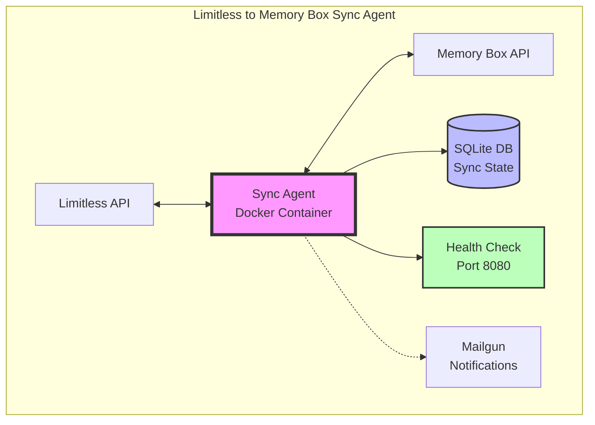
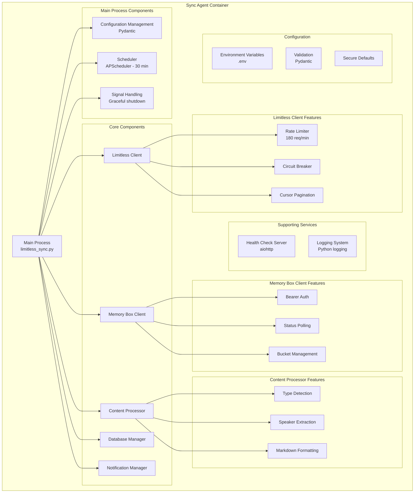

# Limitless to Memory Box Sync Agent - Architecture & Design

## Executive Summary

This document outlines the architecture and design of the Limitless to Memory Box Sync Agent, a production-ready Python application that automatically synchronizes lifelog data from the Limitless Pendant to Memory Box, providing seamless integration between personal conversation capture and semantic memory storage.

## Table of Contents

1. [System Overview](#system-overview)
2. [Architecture Design](#architecture-design)
3. [Component Specifications](#component-specifications)
4. [Data Models](#data-models)
5. [API Integration Strategy](#api-integration-strategy)
6. [Database Design](#database-design)
7. [Error Handling & Resilience](#error-handling--resilience)
8. [Security Architecture](#security-architecture)
9. [Performance & Scalability](#performance--scalability)
10. [Deployment Strategy](#deployment-strategy)
11. [Monitoring & Observability](#monitoring--observability)
12. [Current Implementation Status](#current-implementation-status)

## System Overview

### Purpose
The Limitless to Memory Box Sync Agent bridges the gap between Limitless Pendant's conversation capture and Memory Box's semantic memory storage, enabling users to search and discover their conversations within a unified knowledge management system accessible by any AI with Memory Box integration.

### Key Features
- **Automated Sync**: Continuous synchronization every 30 minutes
- **Incremental Processing**: Duplicate prevention through lifelog ID tracking
- **Full Content Preservation**: Complete conversation transcripts, not summaries
- **Intelligent Categorization**: Automatic classification (MEETING, TECHNICAL, DECISION, etc.)
- **Production Reliability**: Health checks, monitoring, error handling
- **Docker Deployment**: Container-ready with docker-compose

### Current Status
- ✅ **Production Ready**: Successfully syncing lifelogs
- ✅ **System Operational**: Processing lifelogs every 30 minutes
- ✅ **Health Monitoring**: Fixed endpoints with no false negatives
- ✅ **Secure Configuration**: No sensitive data exposed

## Architecture Design

### High-Level System Architecture



### Component Architecture



## Component Specifications

### 1. Configuration Management (`src/config.py`)

**Implementation**: Pydantic-based configuration with validation

**Key Features**:
- Environment variable loading with `.env` support
- Type validation and constraints
- Secure defaults for all settings
- No sensitive data in logs or health checks

**Current Configuration**:
```python
# Required API Configuration
LIMITLESS_API_KEY: str
MEMORYBOX_API_KEY: str
MEMORYBOX_API_URL: str
MEMORYBOX_BUCKET: str

# Optional Settings (with defaults)
SYNC_INTERVAL_MINUTES: int = 30
TIMEZONE: str = "America/New_York"
RATE_LIMIT_REQUESTS_PER_MINUTE: int = 180
BATCH_SIZE: int = 10
```

### 2. Data Models (`src/models.py`)

**Implementation**: Type-safe dataclasses and enums

**Key Models**:

- **ConversationType**: Enum for conversation classification
  - MEETING, TECHNICAL, DECISION, PERSONAL, CONVERSATION

- **LifelogEntry**: Core data structure from Limitless API
  - Includes full content nodes, speakers, timestamps
  - Preserves complete conversation structure

- **ContentNode**: Hierarchical content representation
  - Supports headings, blockquotes, speaker attribution
  - Maintains temporal relationships

- **ProcessingStatus**: Sync state tracking
  - PENDING, PROCESSED, FAILED, REQUIRES_PROCESSING

- **SyncResult**: Operation outcome tracking
  - Success/error counts, duration, error details

### 3. Database Management (`src/database.py`)

**Implementation**: SQLite with comprehensive state tracking

**Current Schema**:
```sql
-- Core sync state
sync_state (id, last_sync_time, total_synced, created_at, updated_at)

-- Individual lifelog tracking  
synced_lifelogs (lifelog_id, memory_box_id, synced_at, title, 
                start_time, end_time, processing_status, retry_count, 
                last_error, created_at)

-- Error tracking
sync_errors (id, lifelog_id, error_type, error_message, 
            error_details, occurred_at, resolved_at)

-- Performance metrics
sync_metrics (id, sync_started_at, sync_completed_at, 
             lifelogs_processed, lifelogs_successful, 
             lifelogs_failed, total_duration_seconds, 
             average_processing_time_ms)
```

### 4. Limitless API Client (`src/limitless_client.py`)

**Implementation**: Async HTTP client with resilience features

**Key Features**:
- **Adaptive Rate Limiter**: Token bucket with burst capacity
- **Circuit Breaker**: Fails fast after 5 consecutive errors
- **Retry Logic**: Exponential backoff with jitter
- **Pagination**: Automatic cursor-based pagination
- **Full Content**: Fetches markdown and structured content

### 5. Memory Box API Client (`src/memorybox_client.py`)

**Implementation**: Async client following Memory Box v2 API

**Key Features**:
- **Bearer Authentication**: User ID as bearer token
- **Status Polling**: Waits for processing completion
- **Rich Metadata**: Full reference data structure
- **Bucket Management**: Auto-creates buckets if needed
- **Error Handling**: Comprehensive error categorization

### 6. Content Processor (`src/content_processor.py`)

**Implementation**: Intelligent content analysis and formatting

**Key Features**:
- **Type Classification**: Keyword-based conversation categorization
- **Speaker Extraction**: Identifies all participants
- **Key Points**: Extracts important headings/decisions
- **Tag Generation**: Creates searchable tags
- **Markdown Output**: Optimized for Memory Box search

**Processing Pipeline**:
1. Analyze content structure
2. Determine conversation type
3. Extract speakers
4. Format as searchable markdown
5. Generate metadata tags

### 7. Health Checker (`src/health.py`)

**Implementation**: aiohttp-based health check server

**Endpoints**:
- `/health` - Basic operational status
- `/health/detailed` - Detailed diagnostics (no sensitive data)
- `/ready` - Kubernetes readiness probe
- `/live` - Kubernetes liveness probe

**Health Checks**:
- Database connectivity
- Configuration validity
- Sync activity (within 2 hours)
- Disk space availability
- Memory usage

## API Integration Strategy

### Limitless API Integration

**Current Implementation**:
- **Authentication**: X-API-Key header
- **Rate Limiting**: 180 requests/minute (adaptive)
- **Endpoints Used**:
  - `GET /v1/lifelogs` - Fetch with pagination
- **Parameters**:
  - `includeMarkdown=true` - Full content
  - `includeHeadings=true` - Structure preservation
  - `direction=asc` - Chronological processing

### Memory Box API Integration

**Current Implementation**:
- **Authentication**: Bearer token (user ID)
- **Endpoints Used**:
  - `POST /api/v2/memory` - Create memories
  - `GET /api/v2/memory/{id}/status` - Check processing
  - `GET /api/v2/buckets` - List buckets
  - `POST /api/v2/buckets` - Create buckets
- **Processing**: Polls until status is "processed"

## Error Handling & Resilience

### Implemented Patterns

1. **Circuit Breaker**
   - Opens after 5 consecutive failures
   - Recovery timeout: 60 seconds
   - Prevents cascade failures

2. **Rate Limiting**
   - Adaptive token bucket algorithm
   - Handles 429 responses gracefully
   - Respects retry-after headers

3. **Retry Logic**
   - Exponential backoff with jitter
   - Max 3 retries for transient errors
   - Different strategies per error type

4. **Error Tracking**
   - All errors logged to database
   - Retry counts maintained
   - Email alerts for failures

## Security Architecture

### Current Implementation

1. **API Key Management**
   - Environment variables only
   - No keys in source code
   - No sensitive data in health checks

2. **Network Security**
   - HTTPS for all API calls
   - Connection timeouts enforced
   - No sensitive data in logs

3. **Data Protection**
   - SQLite with restricted permissions
   - Log sanitization implemented
   - Secure Docker user context

## Performance & Scalability

### Current Performance

- **Sync Interval**: 30 minutes (configurable)
- **Processing Rate**: ~1 second per lifelog
- **Memory Usage**: < 512MB container limit
- **Database Size**: Minimal growth (~1KB per lifelog)

### Optimization Features

1. **Incremental Sync**: Only new lifelogs processed
2. **Duplicate Prevention**: Lifelog ID tracking
3. **Batch Processing**: Configurable batch size
4. **Connection Pooling**: Reused HTTP connections
5. **Async Operations**: Non-blocking I/O

## Deployment Strategy

### Docker Implementation

**Multi-stage Dockerfile**:
- Build stage: Dependencies only
- Runtime stage: Minimal image
- Non-root user: Security hardening
- Health check: Built-in monitoring

**Docker Compose**:
```yaml
services:
  limitless-sync:
    build: .
    container_name: limitless-memory-sync
    restart: unless-stopped
    env_file: .env
    volumes:
      - ./data:/app/data
      - ./logs:/app/logs
    ports:
      - "8080:8080"
    healthcheck:
      test: ["CMD", "python", "health_check.py"]
      interval: 30s
    deploy:
      resources:
        limits:
          memory: 512M
```

## Monitoring & Observability

### Current Implementation

1. **Health Checks**
   - HTTP endpoints for monitoring
   - No false negatives
   - Sync activity tracking

2. **Logging**
   - Structured Python logging
   - Log rotation configured
   - Error categorization

3. **Database Metrics**
   - Sync success rates
   - Processing times
   - Error frequencies

4. **Email Notifications**
   - Error alerts
   - Daily summaries (optional)
   - Startup/shutdown notifications

## Current Implementation Status

### ✅ Completed Features

**Core Functionality**:
- Incremental sync with state tracking
- Full content preservation
- Intelligent categorization
- Rate limiting and circuit breakers
- Comprehensive error handling

**Production Features**:
- Docker containerization
- Health check endpoints (fixed)
- Email notifications
- Database maintenance tools
- API troubleshooting guide

**Documentation**:
- Comprehensive README
- Database maintenance guide
- API troubleshooting guide
- Architecture documentation (this file)

### 📊 System Performance

- **Sync Interval**: Every 30 minutes
- **Processing Speed**: < 1 second per lifelog
- **Health Status**: All systems operational
- **Error Handling**: Comprehensive retry logic

### 🚀 Future Enhancements

**Short Term**:
- Retry mechanism for failed lifelogs
- Batch processing optimization
- Prometheus metrics endpoint

**Long Term**:
- Real-time streaming support
- Multi-user deployment
- Advanced privacy controls
- Additional data sources

## Conclusion

The Limitless to Memory Box Sync Agent is a production-ready system that successfully bridges personal conversation capture with semantic memory storage. The architecture emphasizes reliability, security, and maintainability while providing vendor-agnostic access to lifelog data for any AI system with Memory Box integration.

Key achievements:
- **Reliable Sync**: Incremental processing with duplicate prevention
- **Production Ready**: Health monitoring, error handling, containerization
- **Secure**: No sensitive data exposure, environment-based configuration
- **Maintainable**: Comprehensive documentation and tooling
- **Extensible**: Modular architecture supports future enhancements
