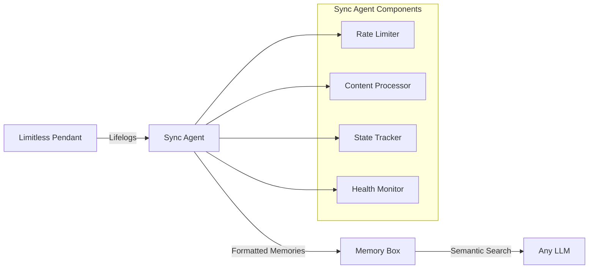

# 🧠 Limitless to Memory Box Sync Agent

> **Transform your Limitless Pendant conversations into a searchable, semantic memory layer accessible by any AI system**

[](https://www.docker.com/)
[](https://www.python.org/)
[](LICENSE)

## 🌟 Overview

This sync agent enables you to synchronize your Limitless Pendant lifelog data to Memory Box, creating a **vendor-agnostic semantic memory layer** that can be accessed by any AI system with Memory Box integration.

### Key Benefits

- **🔓 Vendor Independence**: Access your lifelog data from any AI provider with Memory Box support
- **🧩 Composable Architecture**: Modular design allows extension for additional data sources or consumers
- **🎯 Semantic Search**: Query your memories using natural language through Memory Box's search API
- **📊 Full Content**: Stores complete conversation transcripts with metadata
- **🔐 Data Control**: Your memories are stored in your own Memory Box instance

## 🚀 What It Does

The Limitless to Memory Box Sync Agent continuously synchronizes your Limitless Pendant lifelog data to Memory Box, creating a persistent, searchable memory layer for AI applications.

### Key Features

- **Incremental Sync**: Only processes new lifelogs, preventing duplicates
- **Intelligent Categorization**: Automatically classifies conversations (meetings, technical discussions, decisions, etc.)
- **Speaker Attribution**: Preserves who said what in multi-person conversations
- **Production Ready**: Health checks, monitoring, error handling, and notifications
- **Full Content Preservation**: Stores complete transcripts with rich metadata

## 🏗️ Architecture



## 📦 Installation

### Prerequisites

- Docker and Docker Compose
- Limitless API Key (from [app.limitless.ai](https://app.limitless.ai))
- Memory Box API Key
- (Optional) Mailgun API credentials for notifications

### Quick Start

1. **Clone the repository**
   ```bash
   git clone https://github.com/amotivv/limitless-memory-box.git
   cd limitless-memory-box
   ```

2. **Configure environment**
   ```bash
   cp .env.template .env
   # Edit .env with your API keys
   ```

3. **Start the sync agent**
   ```bash
   docker-compose up -d
   ```

4. **Check health status**
   ```bash
   curl http://localhost:8080/health | jq '.'
   ```

## 🔧 Configuration

### Environment Variables

| Variable | Description | Required |
|----------|-------------|----------|
| `LIMITLESS_API_KEY` | Your Limitless API key | ✅ |
| `MEMORYBOX_API_KEY` | Your Memory Box user ID | ✅ |
| `MEMORYBOX_API_URL` | Memory Box API endpoint | ✅ |
| `MEMORYBOX_BUCKET` | Bucket name for memories | ✅ |
| `SYNC_INTERVAL_MINUTES` | How often to sync (default: 30) | ❌ |
| `TIMEZONE` | Your timezone (default: America/New_York) | ❌ |

### Advanced Configuration

See [.env.template](.env.template) for all available options including:
- Rate limiting controls
- Notification settings
- Health check configuration
- Logging levels

## 📊 Monitoring

### Health Check Endpoints

- `GET /health` - Basic health status
- `GET /health/detailed` - Detailed system information
- `GET /health/ready` - Kubernetes readiness probe
- `GET /health/live` - Kubernetes liveness probe

### Database Maintenance

Check sync status:
```bash
docker-compose exec limitless-sync sqlite3 /app/data/limitless_sync.db \
  "SELECT * FROM sync_state;"
```

View recent syncs:
```bash
docker-compose exec limitless-sync sqlite3 /app/data/limitless_sync.db \
  "SELECT lifelog_id, title, synced_at FROM synced_lifelogs ORDER BY synced_at DESC LIMIT 10;"
```

See [DATABASE_MAINTENANCE.md](DATABASE_MAINTENANCE.md) for comprehensive database management commands.

## 🧠 How Memories Are Processed

### Content Enhancement

Each lifelog is intelligently processed to maximize searchability and context:

```markdown
# Meeting with Product Team

## Metadata
**Date:** 2025-08-01 14:30
**Duration:** 45 minutes
**Type:** MEETING
**Participants:** John, Sarah, Mike

## Content
[Full conversation transcript with speaker attribution]

## Key Points
- Decided to prioritize mobile app development
- Q3 timeline approved
- Budget allocated for two additional developers

---
**Tags:** meeting, product, decision, august-2025, afternoon
```

### Conversation Types

The system automatically categorizes conversations:
- **MEETING**: Standups, reviews, planning sessions
- **TECHNICAL**: Code discussions, debugging, architecture
- **DECISION**: Strategic choices, planning, conclusions
- **PERSONAL**: Casual conversations, personal notes
- **CONVERSATION**: General discussions

## 🔍 Accessing Your Memories

Once synced to Memory Box, your memories can be accessed by any system with Memory Box integration:

### For LLMs
```python
# Any LLM with Memory Box access can query your lifelogs
response = memory_box.search(
    query="What did we decide about the mobile app?",
    bucket="your-lifelog-bucket"
)
```

### Direct API Access
```bash
curl -X GET "https://your-memorybox-url/api/v2/memory" \
  -H "Authorization: Bearer YOUR_API_KEY" \
  -d "query=meeting+with+product+team"
```

## 🛠️ Troubleshooting

### Common Issues

1. **Health check shows unhealthy**
   - Check logs: `docker-compose logs -f limitless-sync`
   - Verify API keys are correct
   - Ensure Memory Box is accessible

2. **No new lifelogs syncing**
   - Check Limitless API: See [LIMITLESS_API_TROUBLESHOOTING.md](LIMITLESS_API_TROUBLESHOOTING.md)
   - Verify sync is running: `curl http://localhost:8080/health/detailed`

3. **Rate limiting errors**
   - The agent handles rate limits automatically
   - Adjust `RATE_LIMIT_REQUESTS_PER_MINUTE` if needed

## 🚀 Advanced Usage

### Custom Memory Processing

Extend the content processor for custom formatting:

```python
# src/content_processor.py
def process_lifelog(self, entry: LifelogEntry):
    # Add your custom processing logic
    pass
```

### Multi-User Support

Deploy multiple instances with different configurations. This is a conceptual example - additional configuration required:

```yaml
# docker-compose.multi-user.yml (conceptual example)
services:
  sync-user1:
    extends:
      file: docker-compose.yml
      service: limitless-sync
    container_name: limitless-memory-sync-user1
    environment:
      - LIMITLESS_API_KEY=${USER1_LIMITLESS_KEY}
      - MEMORYBOX_API_KEY=${USER1_MEMORYBOX_KEY}
      - MEMORYBOX_BUCKET=user1-lifelogs
    volumes:
      - ./data/user1:/app/data
      - ./logs/user1:/app/logs
    ports:
      - "8081:8080"
  
  sync-user2:
    extends:
      file: docker-compose.yml
      service: limitless-sync
    container_name: limitless-memory-sync-user2
    environment:
      - LIMITLESS_API_KEY=${USER2_LIMITLESS_KEY}
      - MEMORYBOX_API_KEY=${USER2_MEMORYBOX_KEY}
      - MEMORYBOX_BUCKET=user2-lifelogs
    volumes:
      - ./data/user2:/app/data
      - ./logs/user2:/app/logs
    ports:
      - "8082:8080"
```

**Note:** Each user instance requires:
- Separate API keys for both Limitless and Memory Box
- Unique data and log directories
- Different host ports for health check endpoints
- All other required environment variables (see `.env.template`)

## 🤝 Contributing

We welcome contributions! Please open an issue to discuss proposed changes or submit a pull request.

### Development Setup

```bash
# Create virtual environment
python -m venv venv
source venv/bin/activate

# Install dependencies
pip install -r requirements.txt

# Run tests
pytest tests/
```

## 📈 Future Roadmap

- **Real-time streaming**: Process lifelogs as they're created
- **Multi-modal support**: Images, audio clips from conversations
- **Privacy controls**: Fine-grained control over what gets synced
- **Analytics dashboard**: Visualize your conversation patterns
- **Additional integrations**: Support for other wearables and data sources

## 🙏 Acknowledgments

This project integrates with:
- [Limitless](https://limitless.ai) - Wearable AI device and API
- [Memory Box](https://memorybox.dev) - Semantic memory storage system by amotivv, inc.

## 📄 License

This project is licensed under the MIT License - see the [LICENSE](LICENSE) file for details.

---

<div align="center">

[Report Bug](https://github.com/amotivv/limitless-memory-box/issues) · [Request Feature](https://github.com/amotivv/limitless-memory-box/issues) · [Documentation](https://github.com/amotivv/limitless-memory-box/wiki)

</div>
